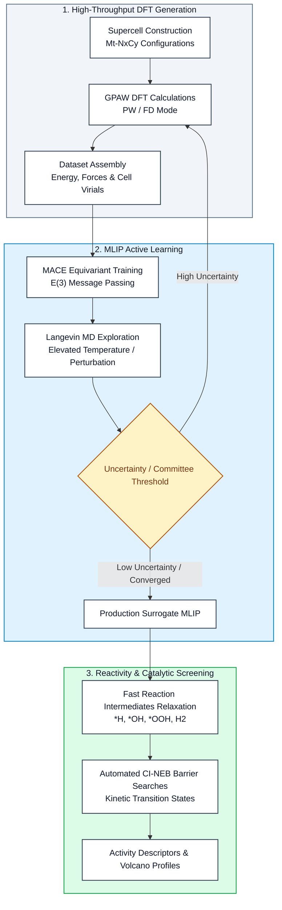

# Autonomous High-Throughput Single-Atom Catalysis Platform with MACE

An end-to-end computational pipeline designed to autonomously synthesize Single-Atom Catalyst (SAC) architectures, sample phase space using ab initio calculations (GPAW PBE-D3 + Langevin AIMD), fine-tune Machine Learning Interatomic Potentials (MACE), and screen reaction kinetics via Climbing-Image Nudged Elastic Band (CI-NEB) and long-timescale molecular dynamics.

---

## Key Features

- **Zero-Prerequisite Substrate Synthesis:** Builds graphene supercells analytically, punches divacancy pores, coordinates target metals, and runs adaptive BFGS pre-relaxations.
- **10 Realistic Motifs:** Systematically covers saturated 4-coordinated ($M\text{-N}_x\text{C}_{4-x}$) and single-vacancy 3-coordinated ($M\text{-N}_x\text{C}_{3-x}$) cavities without unphysical pore-collapse artifacts.
- **Phase-Space Sampling:** Resolves out-of-distribution (OOD) extrapolation errors with targeted $z$-approach scans, $\mathrm{H-H}$ bond cleavage grids, and $NVT$ AIMD snapshots.
- **Automated MACE Fine-Tuning:** Benchmarks zero-shot foundation models (MACE-MP-0), fine-tunes a local potential, and quantifies performance improvements.
- **Catalytic Reaction Profiling:** Automated CI-NEB across all 10 motifs to extract activation barriers ($E_a$), reaction energies ($\Delta E$), and harmonic free energy corrections ($\Delta G^\ddagger$ at $T, P$).
- **Active-Learning Dynamics:** Production MD with automated force-norm tripwires that dump high-uncertainty configurations back to DFT.

---

### Computational Parameters & Convergence Notes

- **Supercell Architecture**: A 4×4 graphene supercell (31–33 atoms depending on H₂ adsorption state) with a 15 Å vacuum spacing along the z-axis is employed as the default benchmark. This setup yields an inter-site TM-TM separation of ~9.8 Å, which comfortably accommodates the local interaction cutoff of the MACE foundation model ($r_{\text{cut}} = 5.0$ Å) while drastically accelerating high-throughput screening.
- **DFT Parameters (GPAW)**: Plane-wave / grid cutoff of 350 eV with PBE-D3 dispersion corrections. This configuration provides smooth, conservative force gradients (numerical noise < 0.05 eV/Å) suitable for training equivariant message-passing potentials while allowing the full autonomous pipeline to run efficiently on standard multi-core workstations.
- **Production Scaling**: For ultra-high precision sub-chemical accuracy (< 0.02 eV barrier shifts), parameters can be readily scaled to 5×5 supercells and 450+ eV cutoffs directly in `config.yaml`.

---

## 🔄 Autonomous Workflow Architecture

The pipeline orchestrates an active-learning feedback loop coupling first-principles density functional theory (GPAW) with equivariant machine learning interatomic potentials (MACE) to screen single-atom catalyst stability and reactivity without manual intervention.


---

---

## 🔍 Data Inspection & Analysis

The pipeline serializes all intermediate structural snapshots, DFT trajectories, and single-point evaluations into an atomic SQLite database via ASE (`catalysis.db`).

### 1. Command-Line Queries
```bash
# Display summary of stored structures and custom keys
ase db catalysis.db

# Filter for specific single-atom coordination motifs
ase db catalysis.db motif="Mt-N4"

# Query structures by transition-state stretch distance (d_bond > 1.8 Å)
ase db catalysis.db "d_bond>1.8" -c id,formula,energy,fmax,motif

# Extract configurations to an extended XYZ file for visualization
ase convert catalysis.db:motif="Mt-N3C1" sub_dataset.xyz
```

### 2. Interactive Web GUI
Launch a local web interface to inspect structures, 3D coordinates, and electronic properties interactively:
```bash
ase db catalysis.db -w
```
*Open your browser and navigate to `http://localhost:5000` to filter, sort, and visualize structures directly.*

---

## ⚙️ Configuration & Customization (`config.yaml`)

Key operational parameters can be customized without touching core execution scripts:

```yaml
system:
  supercell: [4, 4, 1]          # Scalable to [5, 5, 1] for ultra-low boundary coupling
  vacuum: 15.0                  # Vacuum thickness in Angstroms along z-axis
  metal: "Pt"                   # Target single-atom center (e.g., Pt, Fe, Co, Ni)

gpaw_parameters:
  mode: "pw"                    # "pw" (plane-wave) or "fd" (finite-difference)
  energy_cutoff: 350            # Cutoff energy in eV
  kpts: [1, 1, 1]               # Gamma-point sampling for supercells
  xc: "PBE"                     # Functional: PBE with D3 dispersion correction

mace_tuning:
  model_size: "medium"          # MACE architecture scale
  r_max: 5.0                    # Interaction radial cutoff in Angstroms
  max_epochs: 250               # Fine-tuning epochs
  loss: "weighted"              # Energy vs. force balancing mode
```

---

## 🛠 Troubleshooting & Common Pitfalls

- **Pore Collapse During Pre-relaxation**: If coordinating metals drop out of single or double vacancies, increase the BFGS pre-relaxation step limit or verify `vacuum` spacing in `config.yaml`.
- **GPAW Plane-Wave Memory Overrun**: High cutoffs on large supercells can exceed memory allocations. Set `mode: "fd"` (finite-difference grid) for lower memory footprints during high-throughput screening phases.
- **MACE CUDA Out-of-Memory**: Reduce the training batch size in `config.yaml` or reduce the maximum number of active-learning snapshots stored per fine-tuning iteration.

---

## 📚 Related Publications & Theoretical Background

This automated framework builds on the theoretical models and single-atom catalytic mechanisms explored in:

    How N-Doping Promotes Hydrogen Evolution at Graphene-Based Single-Atom Catalysts
```bibtex
@article{ziat2026ndoping,
  author    = {Ziat, Safouan and Brix, F. and Tsaturyan, A. and Kierren, B. and Gaudry, {\'E}.},
  title     = {How N-Doping Promotes Hydrogen Dissociation at Graphene-Based Single-Atom Catalysts},
  journal   = {The Journal of Physical Chemistry Letters},
  year      = {2026},
  doi       = {10.1021/acs.jpclett.5c03805}
}
```
---
📖 Citation

If you use this autonomous pipeline implementation in your research or workflows, please cite the repository:

@software{ziat2026autonomous_pipeline,
  author    = {Ziat, Safouan},
  title     = {Autonomous High-Throughput Single-Atom Catalysis Screening Pipeline with GPAW and MACE},
  url       = {[https://github.com/safouanziat/Autonomous_Pipeline_SAC](https://github.com/safouanziat/Autonomous_Pipeline_SAC)},
  year      = {2026}
}
