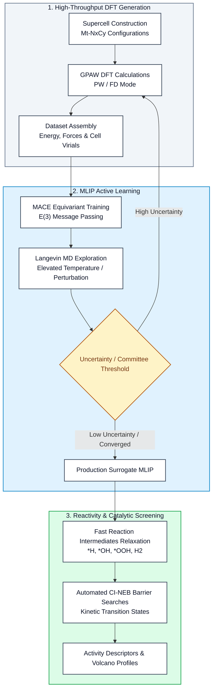

<div align="center">

# ⚛️ Autonomous High-Throughput Single-Atom Catalysis Platform with MACE

**From supercell construction to DFT, active-learned MLIPs and CI-NEB kinetics, without manual intervention**


[Overview](#-overview) · [Features](#-key-features) · [Workflow](#-autonomous-workflow-architecture) · [Parameters](#-computational-parameters--convergence-notes) · [Data inspection](#-data-inspection--analysis) · [Configuration](#-configuration--customization-configyaml) · [Troubleshooting](#-troubleshooting--common-pitfalls) · [Citation](#-citation)

</div>

---

## 📖 Overview

An end-to-end computational pipeline that autonomously:

1. **synthesizes** Single-Atom Catalyst (SAC) architectures,
2. **samples** phase space with *ab initio* calculations (GPAW PBE-D3 + Langevin AIMD),
3. **fine-tunes** Machine Learning Interatomic Potentials (MACE),
4. **screens** reaction kinetics with Climbing-Image Nudged Elastic Band (CI-NEB) and long-timescale molecular dynamics.

---

## ✨ Key Features

| Feature | Description | Entry point |
| :--- | :--- | :--- |
| **Zero-prerequisite substrate synthesis** | Programmatic construction of the graphene substrate with vacancy pores and metal anchoring | `synthesize_pristine_sac` |
| **10 realistic motifs** | Systematic coverage of saturated 4-coordinated M–N<sub>x</sub>C<sub>4−x</sub> and single-vacancy 3-coordinated M–N<sub>x</sub>C<sub>3−x</sub> motifs, without unphysical pore-collapse artifacts | `generate_motifs` |
| **Phase-space sampling** | Static configurations, rattle perturbations and molecular approach scans | `sample_static_configurations` |
| **DFT calculations (GPAW)** | Plane-wave / grid methods with spin polarization, k-point sampling and DFT-D3 dispersion corrections | `run_dft_evaluation`, `run_aimd_trajectory` |
| **Dataset export & MACE training** | Energy, force and cell-virial datasets, then automated equivariant MLIP training | `export_mace_datasets`, `train_mace_model` |
| **Active-learning dynamics** | Production MD with out-of-distribution uncertainty-trap detection that sends high-error configurations back to DFT | `run_production_md` |
| **Kinetic screening (CI-NEB)** | Automated climbing-image NEB with IDPP interpolation and automatic BFGS-to-FIRE optimizer switching | `run_cineb_screening` |
| **Thermodynamics & vibrations** | Zero-point energy (ZPE) and Gibbs free energy ΔG as a function of temperature *T* and pressure *P* | `compute_thermochemistry` |
| **Publication figures** | Parity curves, reaction profiles, volcano diagrams and MD trajectories | `generate_publication_figures` |

---

## 🔄 Autonomous Workflow Architecture

The pipeline orchestrates an active-learning feedback loop coupling first-principles DFT (GPAW) with equivariant MLIPs (MACE) to screen single-atom catalyst stability and reactivity without manual intervention.


```mermaid
flowchart TD
    classDef stepCard fill:#ffffff,stroke:#334155,stroke-width:1.5px,color:#0f172a
    classDef decisionCard fill:#fef3c7,stroke:#b45309,stroke-width:1.5px,color:#78350f

    subgraph S1["1. High-Throughput DFT Generation"]
        A["Supercell Construction<br>Mt-NxCy Configurations"]:::stepCard --> B["GPAW DFT Calculations<br>PW / FD Mode"]:::stepCard
        B --> C["Dataset Assembly<br>Energy, Forces & Cell Virials"]:::stepCard
    end

    subgraph S2["2. MLIP Active Learning"]
        C --> D["MACE Equivariant Training<br>E(3) Message Passing"]:::stepCard
        D --> E["Langevin MD Exploration<br>Elevated Temperature / Perturbation"]:::stepCard
        E --> F{"Uncertainty / Committee Threshold"}:::decisionCard
        F -- High Uncertainty --> B
        F -- Low Uncertainty / Converged --> G["Production Surrogate MLIP"]:::stepCard
    end

    subgraph S3["3. Reactivity & Catalytic Screening"]
        G --> H["Fast Reaction Intermediates Relaxation<br>*H, *OH, *OOH, H2"]:::stepCard
        H --> I["Automated CI-NEB Barrier Searches<br>Kinetic Transition States"]:::stepCard
        I --> J["Activity Descriptors & Volcano Profiles"]:::stepCard
    end

    style S1 fill:#f1f5f9,stroke:#64748b,stroke-width:1.5px,color:#0f172a
    style S2 fill:#e0f2fe,stroke:#0284c7,stroke-width:1.5px,color:#0f172a
    style S3 fill:#dcfce7,stroke:#16a34a,stroke-width:1.5px,color:#0f172a
```

---

## 🧪 Computational Parameters & Convergence Notes

| Setting | Default benchmark | Rationale |
| :--- | :--- | :--- |
| **Supercell** | 4×4 graphene (31–33 atoms depending on H₂ adsorption state), 15 Å vacuum along *z* | Inter-site TM–TM separation of ~9.8 Å comfortably accommodates the MACE foundation-model cutoff (*r*<sub>cut</sub> = 5.0 Å) while greatly accelerating high-throughput screening |
| **DFT (GPAW)** | Plane-wave / grid cutoff of 350 eV, PBE-D3 | Smooth, conservative force gradients (numerical noise < 0.05 eV/Å), suitable for training equivariant message-passing potentials and for running on standard multi-core workstations |
| **Production scaling** | 5×5 supercells, 450+ eV cutoff | For sub-chemical accuracy (< 0.02 eV barrier shifts); set directly in `config.yaml` |

---

## 🔍 Data Inspection & Analysis

The pipeline stores all intermediate structural snapshots, DFT trajectories and single-point evaluations in an SQLite database via ASE (`catalysis.db`).

### 1. Command-line queries

```bash
# Display summary of stored structures and custom keys
ase db catalysis.db

# Filter for specific single-atom coordination motifs
ase db catalysis.db motif="Mt-N4"

# Query structures by transition-state stretch distance (d_bond > 1.8 Å)
ase db catalysis.db "d_bond>1.8" -c id,formula,energy,fmax,motif

# Extract configurations to an extended XYZ file for visualization
ase convert catalysis.db:motif="Mt-N3C1" sub_dataset.xyz
```

### 2. Interactive web GUI

Launch a local web interface to inspect structures, 3D coordinates and electronic properties:

```bash
ase db catalysis.db -w
```

Then open <http://localhost:5000> in your browser to filter, sort and visualize structures.

---

## ⚙️ Configuration & Customization (`config.yaml`)

Key operational parameters can be changed without touching the core scripts:

```yaml
system:
  supercell: [4, 4, 1]          # Scalable to [5, 5, 1] for ultra-low boundary coupling
  vacuum: 15.0                  # Vacuum thickness in Angstroms along z-axis
  metal: "Pt"                   # Target single-atom center (e.g., Pt, Fe, Co, Ni)

gpaw_parameters:
  mode: "pw"                    # "pw" (plane-wave) or "fd" (finite-difference)
  energy_cutoff: 350            # Cutoff energy in eV
  kpts: [1, 1, 1]               # Gamma-point sampling for supercells
  xc: "PBE"                     # Functional: PBE with D3 dispersion correction

mace_tuning:
  model_size: "medium"          # MACE architecture scale
  r_max: 5.0                    # Interaction radial cutoff in Angstroms
  max_epochs: 250               # Fine-tuning epochs
  loss: "weighted"              # Energy vs. force balancing mode
```

---

## 🛠 Troubleshooting & Common Pitfalls

- **Pore collapse during pre-relaxation:** if coordinating metals drop out of single or double vacancies, increase the BFGS pre-relaxation step limit or check the `vacuum` spacing in `config.yaml`.
- **GPAW plane-wave memory overrun:** high cutoffs on large supercells can exceed memory limits. Set `mode: "fd"` (finite-difference grid) for a lower memory footprint during high-throughput screening.
- **MACE CUDA out-of-memory:** reduce the training batch size in `config.yaml`, or reduce the maximum number of active-learning snapshots stored per fine-tuning iteration.

---

## 📚 Related Publication

This framework builds on the models and single-atom catalytic mechanisms explored in:

> **S. Ziat**, F. Brix, A. Tsaturyan, B. Kierren, É. Gaudry,
> *How N-Doping Promotes Hydrogen Dissociation at Graphene-Based Single-Atom Catalysts*,
> **J. Phys. Chem. Lett.**, 2026. [doi:10.1021/acs.jpclett.5c03805](https://doi.org/10.1021/acs.jpclett.5c03805)

```bibtex
@article{ziat2026ndoping,
  author  = {Ziat, Safouan and Brix, F. and Tsaturyan, A. and Kierren, B. and Gaudry, {\'E}.},
  title   = {How N-Doping Promotes Hydrogen Dissociation at Graphene-Based Single-Atom Catalysts},
  journal = {The Journal of Physical Chemistry Letters},
  year    = {2026},
  doi     = {10.1021/acs.jpclett.5c03805}
}
```

---

## 📖 Citation

If you use this pipeline in your research or workflows, please cite the repository:

```bibtex
@software{ziat2026autonomous_pipeline,
  author = {Ziat, Safouan},
  title  = {Autonomous High-Throughput Single-Atom Catalysis Screening Pipeline with GPAW and MACE},
  url    = {https://github.com/safouanziat/Autonomous_Pipeline_SAC},
  year   = {2026}
}
```

---

## 🔗 Related Work

See also [**MACE-ActiveLearning-SAC**](https://github.com/safouanziat/MACE-ActiveLearning-SAC): an autonomous jobflow-based active-learning pipeline for H₂ dissociation on N-doped graphene-supported Pd single-atom catalysts.

---

**Author:** Safouan Ziat · [GitHub](https://github.com/safouanziat)
